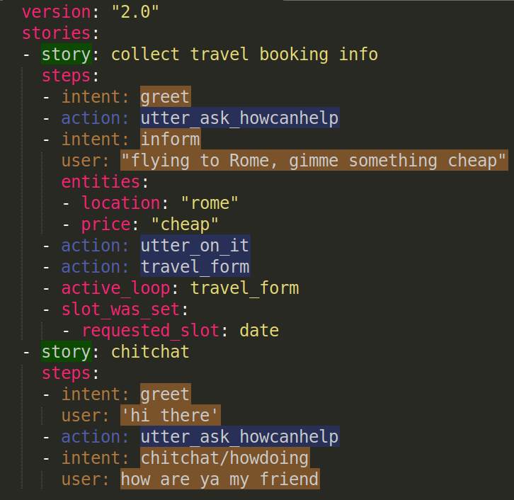

# Syntax highlighting for Rasa YAML data files
## Why
To help you read Rasa data files written in the YAML format, here's some Rasa-specific syntax highlighting! Although the YAML format is more flexible than the previously used Markdown format, some Rasa data files got more cluttered. Especially the story files are somewhat harder to quickly skim through. We can do better with some syntax highlighting:

## What
Currently, Rasa-specific highlighting works only for story files, only in Sublime Text 3, and only for the Monokai theme. While supporting a different theme is easy to do, supporting further Rasa files or editors requires more effort. Feel free to have a go and contribute, or ping me.

## How to use it
To use the improved highlighting in Sublime Text, follow these steps:
1. clone this repo and move the `RasaYamlHighlighting` directory into your Sublime packages directory (typically living under `~/.config/sublime-text-3/Packages`)
2. open a Rasa YAML file and set its syntax to `RasaDataYaml` (`View > Syntax > RasaDataYaml`)

## Want to customise?
If you want to change the colour scheme, edit the (relatively self-explanatory) theme file `RasaYamlHighlighting/Monokai.sublime-color-scheme`. You can also rename the file to suit a different theme of your choice instead of Monokai.

If you want to make more advanced changes (such as highlighting entities), you're in for some more fun. Check out `RasaYamlHighlighting/RasaYaml.sublime-syntax` and make sure you roughly understand what's going on. Maybe look at some contexts I have added in that file, such as `story-start` or `user-pair`. You might need to read about [Sublime Text syntax definitions](http://www.sublimetext.com/docs/3/syntax.html) and about [YAML](https://yaml.org/spec/1.2/spec.html).

Don't forget to share your tweaks by opening a PR on this repo :-)